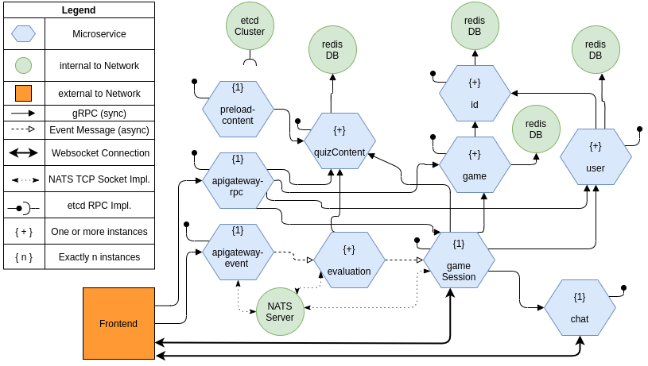

# NameQuiz
## Beschreibung
Die NameQuiz Anwendung dient als Code Basis für das Praktikum im Fach verteilte Softwaresysteme.
Sie zeigt verschiedene Best Practices bezogen auf Microservices in den Bereichen Kommunikation, Load Balancing und Datenspeicher.
## Überblick über die Komponenten:

## Nutzung:
Das Sudo Passwort der VM ist: vss
### Build:
Wird das Repository nicht geklont und nicht aus der VM geholt muss die Anwendung gebaut werden:

#### Backend:

vss@vss-VirtualBox:~/gocode/src/github.com/nameQuiz$ `cd backend`

vss@vss-VirtualBox:~/gocode/src/github.com/nameQuiz/backend$ `sudo docker-compose -f docker-compose.yaml build`

* Soll nur ein einzelner Service neu gebaut werden ist dies mit diesem Befehl möglich:

vss@vss-VirtualBox:~/gocode/src/github.com/nameQuiz/backend$ `sudo docker-compose -f docker-compose.yaml build <service>`

Wobei <service> der Name des Services verwendet wird wie er im  [docker-compose.yml](/backend/docker-compose.yaml) definiert ist.

#### Frontend:

vss@vss-VirtualBox:~/gocode/src/github.com/nameQuiz$ `cd frontend`

vss@vss-VirtualBox:~/gocode/src/github.com/nameQuiz/frontend$ `npm install`

### Starten:
Zum starten der Anwendung kann folgender Befehl ausgeführt werden:

#### Backend:

##### 1. Jeweils eine Instanz:

vss@vss-VirtualBox:~/gocode/src/github.com/nameQuiz/backend$ `sudo docker-compose -f docker-compose.yaml up`

##### 2. Beispiel 5 Instanzen:

vss@vss-VirtualBox:~/gocode/src/github.com/nameQuiz/backend$ `sudo docker-compose -f docker-compose.yaml up --scale game-service=5 --scale evaluation-service=5 --scale id-service=5 --scale user-service=5 --scale quizcontent-service=5`

#### Frontend:
 vss@vss-VirtualBox:~/gocode/src/github.com/nameQuiz/frontend$ `npm run dev`
 
 anschließend sollte das Frontend auf der Adresse: `localhost:3000` laufen.
 
 ### Herunterfahren:
 
 vss@vss-VirtualBox:~/gocode/src/github.com/nameQuiz/backend$ `sudo docker-compose -f docker-compose.yaml down`
 
 ## Nützliches:
 * Folgender Befehl gibt eine Übersicht über alle Docker Container:
 
 vss@vss-VirtualBox:~/gocode/src/github.com/nameQuiz/backend$ `docker container ps -a`
 
 * Folgender Befehl entfernt alle gestoppten Container:
 
  vss@vss-VirtualBox:~/gocode/src/github.com/nameQuiz/backend$ `docker container prune`

